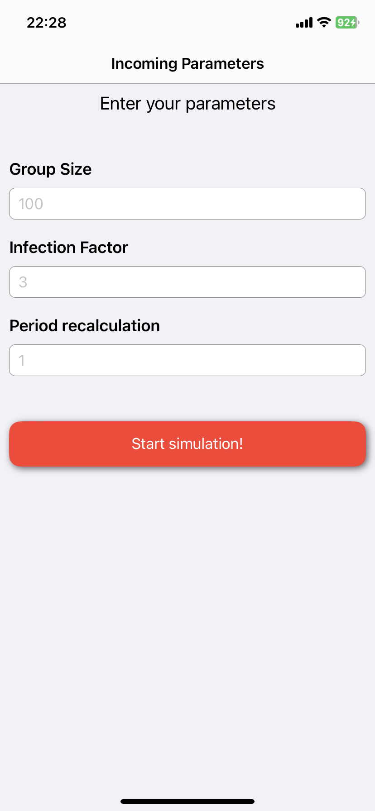
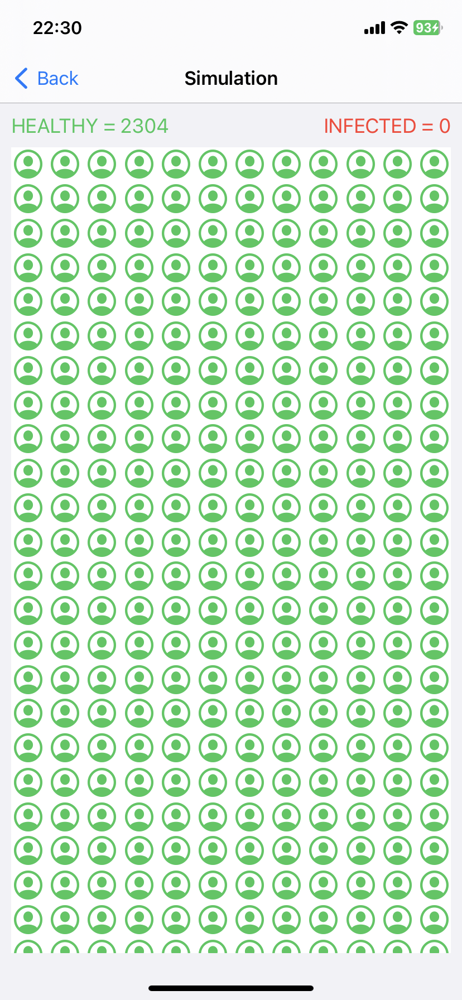
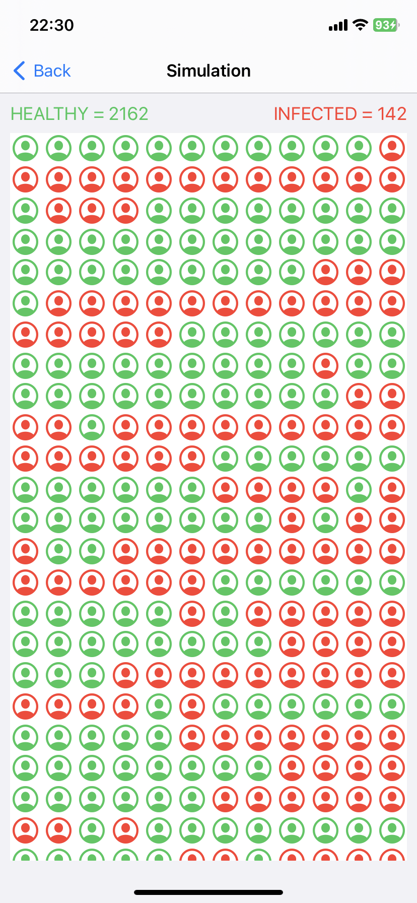

# VirusSpreadSimulation
## Симулятор распространения вируса
### iOS-приложение, которое симулирует и визуализирует распространение инфекции в группе людей.
1) Приложение включает два экрана: 
- экран ввода параметров;
- экран визуализации моделирования.

2) При запуске приложения пользователь видит экран ввода параметров:
- количество людей в моделируемой группе - GroupSize(например, 100);
- количество людей, которое может быть заражено одним человеком при контакте - InfectionFactor(например, 3);
- период пересчёта количества заражённых людей - Т(например, 1 секунда);
- «Запустить моделирование».

3) После ввода параметров и нажатия на кнопку «Запустить моделирование» открывается новый экран моделирования.
4) В начальном состоянии в группе нет инфицированных людей - все объекты отображаются как «здоровые».
5) Если пользователь нажимает на «здоровый» элемент, тот становится «больным» и перерисовывается соответствующим образом. За время работы системы моделирования пользователь может нажимать на неограниченное количество «здоровых» элементов, тем самым «заражая» их.
6) С указанной на экране ввода параметров частотой Т пересчитывается количество «больных» элементов с последующим обновлением экрана.

7) Так же пользователь может видеть количество «зараженных» людей.

  
  
  

